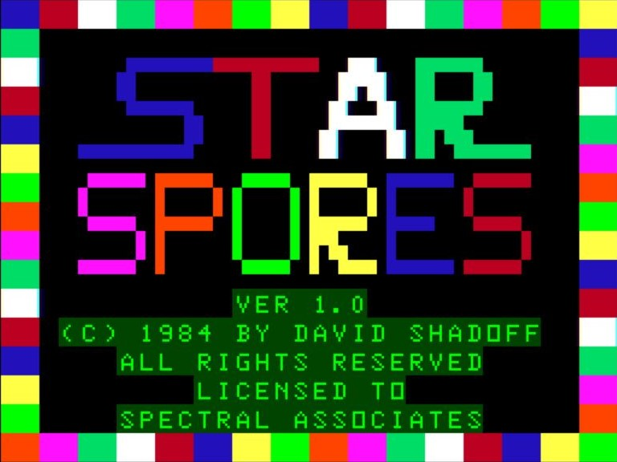
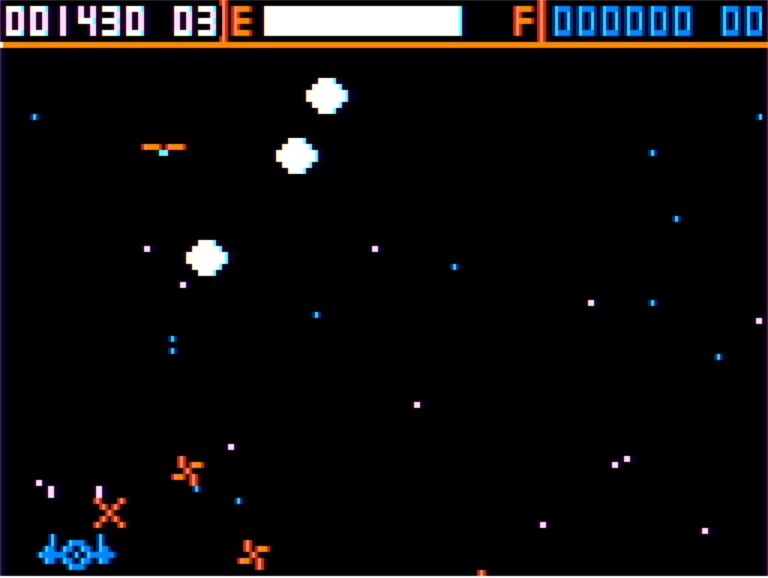

# Star-Spores_CoCo
Repository of information from the development of the Star Spores assembly-language game for the TRS-80 Color Computer in 1983/84

This was largely the same overall game as the one for the TRS-80 Model 1,
but with some additions and improvements.  The Color Computer brought many
benefits, including a 6809 processor and standard hardware for joystick
controls as well as digital sound generation, not to mention colour
graphics at a higher resolution.

The game included more standard patterns for the enemies, plus animation
of the enemy characters while they also performed directional movement.

The game was written in 6809 assembler on a 32K Color Computer with
Extended Color Basic, plus Disk controller and Shugart-type disk drives.
Radio Shack's Disk Extended Color BASIC was embedded in the disk controller,
and Radio Shack's "Disk EDTASM" Editor/Assembler was used to manage and
assemble the source.  Some data was also prepared by hand, and entered
using ZBUG (included with Disk EDTASM).

As the source code was too large to be assembled as a single source file,
the code was broken into several pieces, with the values of key labels
being tracked by hand, and adjusted in the referencing source modules if
the values were to change.

(Special notes on the assembly of the largest source module can be found
in the src/CoCo/note.md file)

As these modules were consuming most of the RAM needed in order to
execute an assembly, comments were not able to be kept in the source
code; rather, they were often managed separately. At the conclusion of
development, I made an effort to create a "gold" assembly output on
fanfold paper, notes for creation of the missing data and re-assembly
of the output, and commented output.  I'm sure I must have laboured over
this for many days, but when I found these notes I was genuinely
surprised that I had had the foresight to do so.

I have re-added these comments back to the source code in the src/cross-asm
subdirectory, where it is possible to re-assemble the full code into binary
form, if you use the cross-assembler from LWTOOLS ( http://www.lwtools.ca/ ).
For more on this, see Build_notes.md in this repository.

There is a release directory in the repository, which contains the 1984
(Licensed to Spectral Associates) version of the code, as rebuilt from
the sources herein. I have verified that this is functionally the same as the
original binary (only differences are unused RAM locations' settings from the
startup RAM format process back in 1984).

## Screenshots

### Title Screen:

### Game Play:

